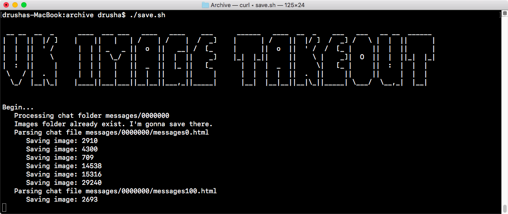

# VK Image Takeout

Скрипт предназначен для выгрузки изображений из диалогов ВК.

## Использование

* Для работы требуются выгруженные переписки из ВК. [Получить их можно тут.](https://vk.com/data_protection?section=rules)
* Помещаем скрипт в корень папки `Archive`.
* `chmod +x save.sh`
* Запускаем `./save.sh`.
